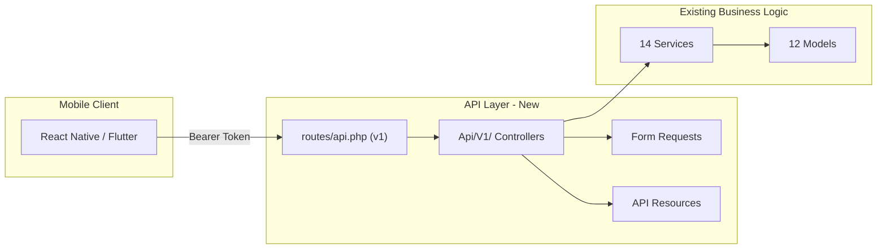

# SoaaR! RESTful API Implementation Plan

## Current State

- **No API infrastructure exists**: no `routes/api.php`, no API controllers, no Sanctum, no API Resources
- **All business logic is ready**: 14 services, 12 models, 11 enums are fully implemented and tested
- **Auth is web/session only** via Inertia — mobile needs token-based auth

## Architecture

All controllers will be thin — they validate via Form Requests, delegate to existing services, and return Eloquent API Resources. No business logic in controllers.

## API Versioning

All routes will be prefixed with `/api/v1/`. Controllers live in `App\Http\Controllers\Api\V1\`. Resources live in `App\Http\Resources\V1\`.

---

## Phase 1: Foundation (Sanctum + Auth Endpoints)

**Goal**: Install Sanctum, wire API routing, build auth endpoints.

**Steps**:

1. Run `php artisan install:api --without-migration-prompt` — scaffolds `routes/api.php`, installs Sanctum, creates `personal_access_tokens` migration, updates [bootstrap/app.php](bootstrap/app.php)
2. Run `php artisan migrate` to create the `personal_access_tokens` table
3. Add `HasApiTokens` trait to [app/Models/User.php](app/Models/User.php)
4. Create `Api/V1/AuthController` with:

- `POST /api/v1/auth/register` — validate, create user, return token
- `POST /api/v1/auth/login` — validate credentials, return token
- `POST /api/v1/auth/logout` — revoke current token (`auth:sanctum`)
- `GET /api/v1/auth/me` — return authenticated user (`auth:sanctum`)

1. Create `App\Http\Resources\V1\UserResource`
2. Create Form Requests: `LoginRequest`, `RegisterRequest` (in `App\Http\Requests\Api\V1\`)
3. Write Pest tests for all 4 auth endpoints

---

## Phase 2: Goals API

**Goal**: Full CRUD + status transitions for goals, delegating to `GoalService` and `GoalCompletionService`.

**Steps**:

1. Create `Api/V1/GoalController` with:

- `GET /api/v1/goals` — list authenticated user's goals
- `POST /api/v1/goals` — create a new goal
- `GET /api/v1/goals/{goal}` — show goal with objectives
- `PUT /api/v1/goals/{goal}` — update goal
- `DELETE /api/v1/goals/{goal}` — delete (with cooldown check via `GoalService::canDeleteGoal`)
- `POST /api/v1/goals/{goal}/cancel` — `GoalService::cancelGoal`
- `POST /api/v1/goals/{goal}/submit-verification` — `GoalVerificationService::submitForVerification`

1. Create `App\Http\Resources\V1\GoalResource` (includes nested objectives count, status, partner info)
2. Create `StoreGoalRequest`, `UpdateGoalRequest` Form Requests
3. Write Pest tests

---

## Phase 3: Objectives & Tasks API

**Goal**: CRUD for objectives and tasks, plus task completion flow.

**Steps**:

1. Create `Api/V1/ObjectiveController`:

- `GET /api/v1/goals/{goal}/objectives` — list objectives for a goal
- `POST /api/v1/goals/{goal}/objectives` — create objective
- `PUT /api/v1/objectives/{objective}` — update
- `DELETE /api/v1/objectives/{objective}` — delete
- `POST /api/v1/objectives/{objective}/complete` — `ObjectiveCompletionService::completeObjective`

1. Create `Api/V1/TaskController`:

- `GET /api/v1/objectives/{objective}/tasks` — list tasks
- `POST /api/v1/objectives/{objective}/tasks` — create task
- `PUT /api/v1/tasks/{task}` — update
- `DELETE /api/v1/tasks/{task}` — delete
- `POST /api/v1/tasks/{task}/complete` — `TaskCompletionService::completeTask` (requires `duration_minutes`)

1. Create `ObjectiveResource`, `TaskResource`
2. Create Form Requests for store/update operations
3. Write Pest tests

---

## Phase 4: Points & Streaks API

**Goal**: Read-only endpoints for points history and streak data.

**Steps**:

1. Create `Api/V1/PointTransactionController`:

- `GET /api/v1/points` — paginated list of user's point transactions
- `GET /api/v1/points/summary` — total points, daily earned, daily remaining

1. Create `Api/V1/StreakController`:

- `GET /api/v1/streaks` — current streak info (current_count, longest_count, last_activity_date)

1. Create `PointTransactionResource`, `StreakResource`
2. Write Pest tests

---

## Phase 5: Accountability Partner & Verification API

**Goal**: Partner request flow and goal verification, delegating to `AccountabilityPartnerService` and `GoalVerificationService`.

**Steps**:

1. Create `Api/V1/PartnerRequestController`:

- `POST /api/v1/goals/{goal}/partner-requests` — `AccountabilityPartnerService::sendRequest`
- `GET /api/v1/partner-requests` — list incoming requests for auth user
- `POST /api/v1/partner-requests/{request}/accept` — `AccountabilityPartnerService::acceptRequest`
- `POST /api/v1/partner-requests/{request}/decline` — `AccountabilityPartnerService::declineRequest`

1. Create `Api/V1/GoalVerificationController`:

- `POST /api/v1/goals/{goal}/approve` — `GoalVerificationService::approveGoal`
- `POST /api/v1/goals/{goal}/reject` — `GoalVerificationService::rejectGoal`

1. Create `PartnerRequestResource`
2. Write Pest tests

---

## Phase 6: Challenges & Leaderboard API

**Goal**: Browse challenges, join/complete them, view leaderboard.

**Steps**:

1. Create `Api/V1/ChallengeController`:

- `GET /api/v1/challenges` — list active challenges
- `GET /api/v1/challenges/{challenge}` — show challenge details
- `POST /api/v1/challenges/{challenge}/join` — `ChallengeService::joinChallenge`
- `POST /api/v1/challenges/{challenge}/complete` — `ChallengeService::completeChallenge`
- `GET /api/v1/challenges/{challenge}/progress` — `ChallengeService::checkProgress`

1. Create `Api/V1/LeaderboardController`:

- `GET /api/v1/leaderboard` — `LeaderboardService::getLeaderboard`
- `GET /api/v1/leaderboard/me` — `LeaderboardService::getUserRank`

1. Create `ChallengeResource`
2. Write Pest tests

---

## Phase 7: Courses & Subscriptions API

**Goal**: Browse courses, enroll, manage subscriptions.

**Steps**:

1. Create `Api/V1/CourseController`:

- `GET /api/v1/courses` — list active courses
- `GET /api/v1/courses/{course}` — show course details
- `POST /api/v1/courses/{course}/enroll` — enroll via `CourseRedemptionService` (accepts `payment_method` and optional `points_to_use`)

1. Create `Api/V1/SubscriptionController`:

- `GET /api/v1/subscription` — current active subscription
- `POST /api/v1/subscription` — `SubscriptionService::subscribe`
- `POST /api/v1/subscription/cancel` — `SubscriptionService::cancel`
- `POST /api/v1/subscription/renew` — `SubscriptionService::renew`

1. Create `CourseResource`, `SubscriptionResource`
2. Write Pest tests

---

## Phase 8: Analytics & Notifications API

**Goal**: User analytics dashboard data and notification management.

**Steps**:

1. Create `Api/V1/AnalyticsController`:

- `GET /api/v1/analytics/summary` — `AnalyticsService::summary`
- `GET /api/v1/analytics/completion-rate` — `AnalyticsService::completionRate`
- `GET /api/v1/analytics/weekly-consistency` — `AnalyticsService::weeklyConsistency`
- `GET /api/v1/analytics/points-history` — `AnalyticsService::pointsHistory`
- `GET /api/v1/analytics/discipline-trend` — `AnalyticsService::disciplineTrend`

1. Create `Api/V1/NotificationController`:

- `GET /api/v1/notifications` — paginated list of database notifications
- `POST /api/v1/notifications/{id}/read` — mark as read
- `POST /api/v1/notifications/read-all` — mark all as read
- `GET /api/v1/notifications/unread-count` — count unread

1. Write Pest tests

---

## Conventions

- **Controllers**: `app/Http/Controllers/Api/V1/` — thin, delegate to services
- **Resources**: `app/Http/Resources/V1/` — consistent JSON response shapes
- **Form Requests**: `app/Http/Requests/Api/V1/` — validation + authorization
- **Routes**: `routes/api.php` — all grouped under `v1` prefix with `auth:sanctum` middleware
- **Tests**: `tests/Feature/Api/` — one test file per controller
- **Error handling**: Return JSON errors with proper HTTP status codes (401, 403, 404, 422)
